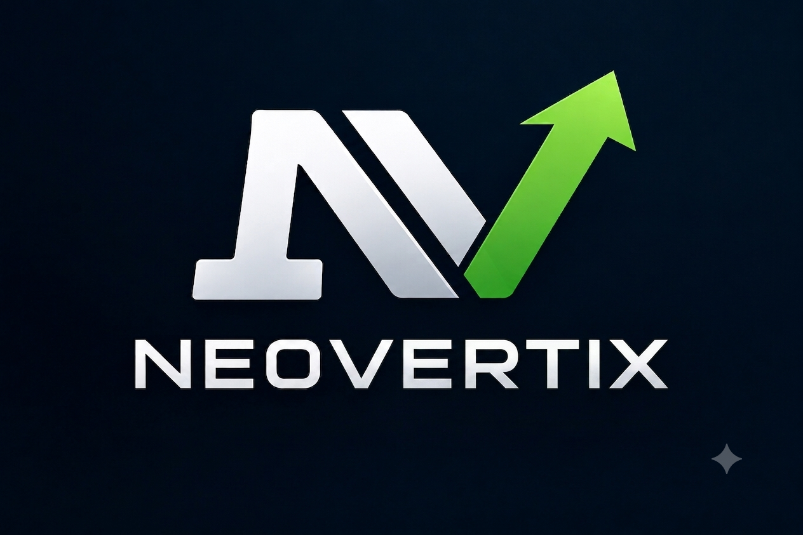

# Neovertix — Brand Book

> Consolidado em 2026-08-05. Fontes: `01-estrategia.md`, `02-oferta.md`, `03-hooks-slogans.md`, `logo/final/logo-neovertix.png`.

---

## 1. Essência da marca

**Neovertix = Neo (novo) + vértice (ápice).**

Todo negócio tem um vértice: o ponto onde atendimento, vendas e operação se cruzam. Durante anos, esse ponto foi sustentado por gente fazendo malabarismo manual — planilha, WhatsApp, CRM meio vazio. A Neovertix nasce pra mover esse ponto: colocar IA no centro da operação, não como enfeite — como estrutura. "Neo" não é modismo: é a aposta de que dá pra reconstruir do zero o jeito de operar um negócio, mais rápido e mais barato do que contratar mais gente. Vértice também é ápice: o lugar mais alto que uma operação pequena alcança quando para de depender só de horas humanas.

**A Neovertix constrói esse novo vértice pra quem tá cansado de operar do jeito antigo.**

## 2. Posicionamento

> Para **PMEs e empreendedores digitais brasileiros** que **perdem vendas por atendimento lento e processos manuais**, a **Neovertix** é a **agência de operações com IA** que **implementa atendimento, SDR e CRM automatizados em semanas — não trimestres**. Diferente de **agências de marketing tradicionais e consultorias de IA genéricas**, nós **colocamos o sistema rodando antes de fechar contrato, com o fundador escrevendo o código — não um departamento comercial entre você e a solução**.

**Categoria:** agência de **operações com IA** (não "marketing digital").

**Promessa central:** *"Colocamos IA para atender e vender por você — rápido, sem parecer robô."*

### Público

- **ICP primário — PME brasileira (5–50 funcionários):** serviços, e-commerce, clínicas, imobiliárias, educação. Tem volume de leads mas perde venda por demora.
- **ICP secundário:** criadores/infoprodutores que escalaram audiência mas não atendimento; pequenas agências (white-label).

### Arquétipo

- **Primário — Mágico:** transforma manual/lento em automático/instantâneo. Sempre com demo ao vivo, nunca só slide.
- **Secundário — Cara Comum:** founder acessível, sem camada de vendas. "Eu que construo, eu que respondo."

### Pilares de mensagem

| Pilar | Ideia central | Prova |
|---|---|---|
| **Rápido de verdade** | Semanas, não trimestres — quem constrói é quem vende | Demo ao vivo com dados reais do prospect |
| **Engenharia, não slide** | Stack de ponta de verdade (agentes IA, n8n, MCPs) | Walkthrough técnico transparente |
| **Você não paga pra descobrir se funciona** | O risco inicial é da Neovertix | Piloto com métrica combinada e garantia |

## 3. Voz

| Atributo | Soa assim | Não soa assim |
|---|---|---|
| Direto | "Seu comercial responde em 30 segundos" | "Podemos ajudar a otimizar seu tempo de resposta" |
| Técnico sem jargão | "O agente lê a mensagem, consulta o CRM e responde" | "Solução omnichannel com IA generativa integrada" |
| Honesto sobre onde estamos | "Somos novos nisso — e construímos junto com você" | "Referência nacional em transformação digital" |
| Sóbrio, não gritado | "Isso aqui funciona. Testamos antes de vender" | "REVOLUCIONE seu atendimento HOJE! 🚀" |
| Orientado a número | "De 4h de triagem manual pra 15 minutos" | "Potencialize a jornada do seu cliente" |

**Léxico da marca:** vértice, construímos, roda sozinho, responde em [tempo], mecanismo, fluxo, testado — não prometido, entrega.

**Banidas:** revolucionar, turbinar, o futuro chegou, funcionário digital que não dorme, disruptivo, sinergia, potencializar, ecossistema, game changer, "vale por N humanos".

## 4. Slogans

**Institucional (definido):**

> **"A gente constrói, não promete."**

Consenso nos três documentos de estratégia — carrega a honestidade da marca e é o antídoto contra o arquétipo Mágico (prova, não fumaça). Uso: assinatura de vídeo, rodapé de site, encerramento de proposta.

**Comercial — ainda em definição.** O Lucas não fechou o slogan comercial oficial. Candidatos favoritos até agora (não usar como definitivo em nenhuma peça):

| Candidato | Direção |
|---|---|
| **"Construímos o ápice, não o enfeite."** | Ambição big tech — mesma ambição pedida pro logo, puxa da própria essência da marca |
| **"Roda sozinho."** | Ultra-curto — léxico oficial isolado, o mais memorável |
| **"Todo lead vira faturamento."** | Resultado bruto — nomeia receita sem rodeio |
| **"Demora não é sua cultura. É sua falta de sistema."** | Provocação — para o scroll sem acusar o dono |
| **"O negócio roda. Você decide."** | Modo automático — resolve com elegância o risco de "automático" soar negligência |

## 5. Oferta (resumo)

**Estrutura em 3 estágios**, mesmos 4 blocos (atendimento IA, SDR IA, CRM, site/landing) em escopo crescente:

| Estágio | Setup | Mensalidade | Pra quem |
|---|---|---|---|
| **Piloto Vértice** | R$ 1.900 (Programa Fundador: R$ 900) | — (único) | Testar o mecanismo num canal antes de comprometer mais |
| **Operação Vértice** | R$ 4.500 | R$ 1.200/mês | PME que já validou e quer o sistema rodando de verdade |
| **Vértice Full** | a partir de R$ 9.000 | a partir de R$ 2.800/mês | Operação com volume/canais múltiplos e prioridade |

**Garantia Vértice (piloto):** métrica combinada por escrito antes de começar. Se não melhorar pelo menos 30% em 2–4 semanas, o piloto não é cobrado — devolução total, sem letra miúda.

**Programa Fundador (3–5 vagas):** primeiros clientes pagam R$ 900 no piloto em troca de autorização de caso de uso + depoimento em vídeo — vaga limitada, não desconto permanente.

## 6. Logo

**Arquivo oficial:** `logo/final/logo-neovertix.png` — asset externo aprovado pelo Lucas, entregue já pronto. Não recriar, não vetorizar, não alterar.

**Construção:** símbolo **N** em gradiente metálico prata/branco, com terminais em flare (cortes angulares nas pontas), sobreposto por uma **seta ascendente verde** que nasce do próprio traço do N e aponta para cima-direita — a leitura visual é literal: crescimento saindo de dentro da estrutura da marca, não colado por cima dela. Abaixo, o wordmark **NEOVERTIX** no mesmo gradiente prata/branco do símbolo, em caixa alta condensada. Tudo sobre fundo navy escuro quase-preto.

**Área de proteção:** manter um espaço livre ao redor do logo equivalente à altura do símbolo N (não do conjunto completo com wordmark). Nenhum elemento — texto, borda, outro logo — deve invadir essa margem.

**Tamanho mínimo:** 120px de largura para a versão completa (símbolo + wordmark) em tela; para aplicações muito pequenas (favicon, avatar de rede social), usar apenas o símbolo N+seta, nunca o wordmark isolado sem o símbolo.

**O que NÃO fazer:**
- Não recolorir o símbolo ou o wordmark (o gradiente prata/branco e o verde da seta são fixos).
- Não distorcer, esticar ou rotacionar.
- Não usar sobre fundo claro sem uma versão adaptada — **ainda não existe versão mono/fundo-claro do logo; isso é um próximo passo pendente**, necessário antes de qualquer aplicação em papel timbrado claro, assinatura de e-mail com fundo branco, etc.
- Não adicionar sombra, contorno ou efeito que não esteja no arquivo original.

## 7. Paleta

Extraída visualmente do logo final (`logo/final/logo-neovertix.png`). Valores completos com anotação de contraste WCAG em `tokens.json` / `tokens.css`.

| Token | Hex | Uso |
|---|---|---|
| `bg-canvas` | `#0A0E1A` | Fundo raiz — navy quase-preto do logo |
| `surface-base` | `#121A2E` | Cards, inputs, nav |
| `surface-raised` | `#1A2440` | Hover, dropdown |
| `surface-overlay` | `#232F52` | Modal, popover, tooltip |
| `text-primary` | `#F5F7FA` | Texto principal — branco-prata do wordmark |
| `text-secondary` | `#AAB4C2` | Texto secundário — extremidade escura do gradiente do N |
| `text-muted` | `#7A8699` | Texto terciário, placeholder |
| `accent` (verde) | `#43A047` | CTA, links, destaque — verde da seta |
| `accent-hover` | `#66BB6A` | Estado hover do acento |
| `accent-light` | `#8BC34A` | Topo do gradiente da seta (uso decorativo) |
| `accent-dim` | `#2E7D32` | Base do gradiente da seta, ênfase reduzida |
| `border-strong` | `#5A6780` | Inputs, outline, foco |

**Contraste validado (WCAG AA):** texto primário 17.9:1 sobre o fundo (AAA), texto secundário 9.2:1 (AAA), botão de acento com texto navy em cima 5.2:1 (AA) — branco sobre o verde do acento reprova (3.3:1), por isso botões primários usam texto escuro, nunca branco.

## 8. Tipografia

- **Display / headlines:** [Chakra Petch](https://fonts.google.com/specimen/Chakra+Petch) (600/700) — sans condensado e geométrico, com cortes angulares que harmonizam com os terminais em flare do N e a geometria da seta do logo, sem competir visualmente quando aparece ao lado dele.
- **Corpo de texto / UI:** [Manrope](https://fonts.google.com/specimen/Manrope) (400/500/600) — sans neutro, alta legibilidade, mantido da base de tokens anterior por já cumprir bem esse papel.
- **Técnico / anotações:** JetBrains Mono (400/500) — trechos de código, eyebrow técnico, reforça o pilar "Engenharia, não slide".

## 9. Aplicação

- **Bio Instagram:** símbolo N+seta como foto de perfil (recorte quadrado, fundo navy `#0A0E1A` preservado). Bio em texto usa a tagline institucional "A gente constrói, não promete." como assinatura — o slogan comercial ainda não está fechado, não usar candidato nenhum como definitivo até o Lucas decidir.
- **Assinatura de e-mail:** logo completo (símbolo + wordmark) em largura reduzida (~160px) só funciona sobre fundo escuro no cliente de e-mail (a maioria é fundo branco) — até existir a versão mono/fundo-claro, preferir só o nome "Neovertix" em texto (Manrope 700, cor `#121A2E` ou preto) + tagline institucional, sem forçar o PNG sobre branco.
- **Proposta comercial:** capa em fundo navy (`bg-canvas`) com o logo centralizado, título em Chakra Petch, corpo em Manrope. Tabela de oferta (Piloto/Operação/Full) usa `surface-base` para os cards e `accent` só no estágio recomendado — reforça a regra "uma cor de destaque por tela" da estratégia.
